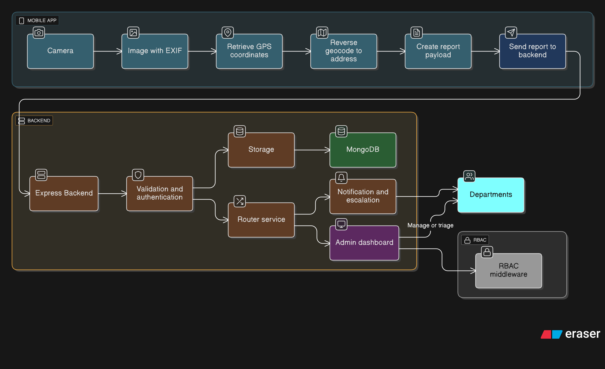

# CivicVoice

Mobile-first civic reporting app built with Flutter.

This application allows users to capture photos of road issues (potholes, damaged signs, blocked drains, etc.) using the device camera, automatically geotags the photo with GPS coordinates and an address, and submits the report to an Express backend which persists it to MongoDB. An Admin Dashboard (separate app/server) displays reports and lets city staff route and escalate issues using role-based access control (RBAC).

## Key features

- Capture an image using the device camera (photo of a road issue).
- Auto-detect current location and fill address + coordinates in the report.
- Attach optional user comments and metadata (category, severity).
- Send reports to an Express backend which stores them in MongoDB.
- Admin Dashboard with RBAC to view, route, escalate, and track reports (by department, budget, position).

## Architecture overview

- Frontend: Flutter mobile app (this repository).
- Backend: Express.js API (separate repository / deployment).
- Database: MongoDB for persisting reports and admin state.
- Admin Dashboard: Web app that consumes the backend API and enforces RBAC.



Flow:
1. User opens mobile app and taps to create a report.
2. App requests camera and location permissions, captures image and GPS location.
3. App reverse-geocodes coordinates to derive an address and pre-fills the form.
4. User submits; app sends image + metadata to Express API.
5. Backend stores report in MongoDB and notifies Admin Dashboard.
6. Admin Dashboard routes/escalates the report to the appropriate department/position according to rules and RBAC.


## Tech stack

- Flutter (Dart) — mobile app code in `lib/`
- Express.js (Node) — backend API (not included in this repo)
- MongoDB — persistent storage for reports

## Notable repo structure (frontend)

- `lib/` — Flutter app source
	- `components/`, `screens/`, `services/` — major app parts
	- `services/complaint_service.dart` — sends reports to backend
- `android/`, `ios/`, `linux/`, `macos/`, `windows/` — platform folders
- `assets/images/` — image assets

## Permissions required

- Camera — capture photos
- Location — obtain GPS coordinates for geotag
- (Optional) Storage / Photos access — for saving or selecting an existing photo

Add the required permissions to AndroidManifest / Info.plist when building:

- Android: add CAMERA and ACCESS_FINE_LOCATION and optionally WRITE_EXTERNAL_STORAGE
- iOS: NSCameraUsageDescription and NSLocationWhenInUseUsageDescription

## API contract (backend)

Note: the Express backend is not in this repository. The following describes the expected API endpoints and payload, so the Flutter app knows how to interact with it.

POST /api/reports
- Description: Create a new road-issue report.
- Content-Type: multipart/form-data (recommended) or application/json with base64 image.
- Fields (multipart form):
	- image: file (photo)
	- latitude: number
	- longitude: number
	- address: string
	- category: string (e.g., pothole, streetlight, signage)
	- severity: string (low|medium|high)
	- notes: string (optional user text)
	- reporterId: string (optional)

Response: 201 Created
{
	"id": "<reportId>",
	"status": "received",
	"createdAt": "2025-11-29T..."
}

GET /api/reports
- List reports (for Admin Dashboard). Supports paging, filters, and RBAC on the server.

PATCH /api/reports/:id
- Update report status, assign to department/position, add comments.

Example report document (MongoDB schema outline)
{
	_id: ObjectId,
	imageUrl: string (or storage reference),
	latitude: number,
	longitude: number,
	address: string,
	category: string,
	severity: string,
	notes: string,
	status: string, // e.g., received, triaged, in_progress, resolved
	assignedTo: { department: string, position: string },
	createdAt: Date,
	reporter: { id?: string, name?: string }
}

## Running the Flutter app (development)

Prerequisites:

- Flutter SDK installed (see https://docs.flutter.dev)
- Android Studio or Xcode for device/emulator
- A running backend API (Express + MongoDB) or a mocked endpoint URL

1. Install packages:

```bash
flutter pub get
```

2. Configure backend URL

Set the backend base URL in `lib/services/api_client.dart` or in the environment config used by the app. By default the app expects something like `http://<backend-host>:3000`.

3. Run on an emulator or device:

```bash
flutter run
```

Development notes:
- The app requires the device/emulator to provide GPS location. On emulators, enable mock location or use host geolocation settings.
- For testing image uploads, the app supports selecting photos from gallery if the emulator can't access a camera.

## Admin Dashboard & RBAC

- The Admin Dashboard is responsible for showing incoming reports, assigning them to departments and positions, and escalating based on budget and issue severity.
- RBAC (role-based access control) should be implemented on the backend for all admin routes. Typical roles: viewer, triage-officer, manager, admin.
- Routing logic: incoming report is inspected (category, severity, location) and routed to a department (e.g., Roads, Drainage, Street Lighting) and an appropriate position within that department. This logic is implemented server-side (see the backend repo).

## Developer API / Integration tips

- If building the backend yourself, prefer storing images in object storage (S3/MinIO) and save the image URL in MongoDB.
- Use multipart/form-data for image uploads to avoid huge base64 payloads.
- Implement indexing on `location` (2dsphere) in MongoDB to support geo-queries.

## Testing

- Add unit/widget tests in `test/` for Flutter UI and service layer.
- For integration, run against a local Express dev server connected to a local MongoDB instance or an ephemeral test DB.

## Security & Privacy

- Mask or anonymize reporter personal data unless explicitly permitted.
- Use TLS for backend endpoints.
- Consider rate-limiting and content moderation for uploaded images.

## Assumptions

- Backend (Express + MongoDB) and Admin Dashboard are separate and not included in this repo.
- The Flutter app uses a REST API; websockets or push notifications can be integrated later for real-time updates.

## Next steps / improvements

1. Add offline-first queueing: cache reports locally and retry upload when network returns.
2. Image compression and orientation fixing before upload.
3. Add e2e tests and CI integration.
4. Integrate push notifications and admin assignment notifications.

## Contact / Contributing

Open issues and PRs are welcome. For architecture questions or coordination with backend and admin dashboard, describe the use case and expected routing/escalation flow.

---
Generated README: describes camera-based civic reporting, geotagging, backend contract (Express + MongoDB), and Admin Dashboard with RBAC and routing/escalation.
